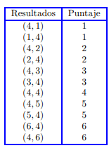

# Proyecto 2 probabilidad y Estadistica 

El objetivo de esta tarea es utilizar la probabilidad condicional como herramienta para analizar un
juego de dados entre dos jugadores. Se hallaran analıticamente probabilidades de que uno de los jugadores obtenga ciertos puntajes. Tambien buscamos realizar una simulacion para determinar si uno de los
jugadores tiene ventaja sobre el otro.
A continuacion se explican las reglas del juego. El juego requiere dos dados para jugarse y se desarrolla
entre dos jugadores, que llamaremos Juan y Marıa. Ambos jugadores lanzaran los dos dados obteniendo
cierto puntaje en el conjunto {0, 1, 2, 3, 4, 5, 6}, gana el jugador que obtiene mas puntos pero observemos
que es posible empatar el juego. Empezamos detallando los puntajes asociados a cada resultado posible al tirar dos dados

El resto de los resultados posibles al tirar dos dados valen 0 puntos.

Supondremos que Juan empieza, el lanzara los dados obteniendo un cierto puntaje. Si Juan obtiene
0 puntos puede tirar los dos dados de nuevo para mejorar su puntaje, en este caso su puntaje final sera
el obtenido en su segunda tirada de los dados; por otro lado, si Juan no obtiene 0 puntos en su primera
tirada, el puede elegir (si ası lo desea) tirar de nuevo el dado que no haya obtenido 4 (o cualquiera de
los dos dados en el caso en que ambos hayan obtenido 4) con el objetivo de mejorar su puntaje, aunque
observemos que hacer esto puede ocasionar que Juan empeore su puntaje; si Juan decide tirar de nuevo
uno de los dados su puntaje final sera el obtenido en esta segunda tirada.

Juan decide usar la siguiente estrategia: si obtiene 0 puntos utilizara su segunda tirada de ambos
dados. Si obtiene 1, 2 o 3 puntos utilizara su segunda tirada de uno de los dados para intentar mejorar su
puntaje, por ultimo si obtiene mas de 3 puntos se plantara en su puntaje y no utilizara su tirada adicional
de uno de los dados.
Cuando Juan termina de jugar le toca a Marıa, que jugara el juego siguiendo las mismas reglas que
Juan, pero tendra la ventaja de saber cual es el puntaje final de Juan

<b> Se pide: </b> 
1. Explique brevemente por que la estrategia elegida por Juan es razonable para intentar ganar el
juego.
2. Hallar analıticamente la probabilidad de que Juan obtenga k puntos en este juego, para los valores
k = 1, 2, 3, 4, 5 y 6.
3. Dise˜nar una estrategia de juego para Marıa que maximice sus chances de ganar (recuerde que Marıa
juega sabiendo el puntaje de Juan).
4. Escriba una funcion en Python que simule la realizacion de todo el juego entre Juan y Marıa. La
funcion debe devolver un cierto dato que indique si hubo victoria de Juan, victoria de Marıa, o si
hubo empate en el juego.
5. Ejecutar la simulacion del juego n = 1000, n = 10000 y n = 100000 veces y calcular la frecuencia
relativa de los eventos “Juan gana el juego”, “Marıa gana el juego” y “El juego resulta en empate”.
6. Utilizar las simulaciones realizadas para determinar si Marıa tiene una ventaja significativa al jugar
este juego.
Sobre el informe:
• El tiempo para entregar el informe es hasta el sabado 11 de mayo inclusive. La entrega se realizara
por webasignatura.
• El informe debera estar en formato pdf, la entrega tambien debera incluir los scripts utilizados en
alguna forma en que sea sencillo para el cuerpo docente ejecutar el codigo para probarlo.
• El informe debera contener tıtulo, fecha, nombre y cedula de los estudiantes.
• Se evaluara: prolijidad del informe, utilizacion correcta del idioma espa˜nol, redaccion, prolijidad del
codigo presentado en los scripts, introduccion, marco teorico, conclusiones.